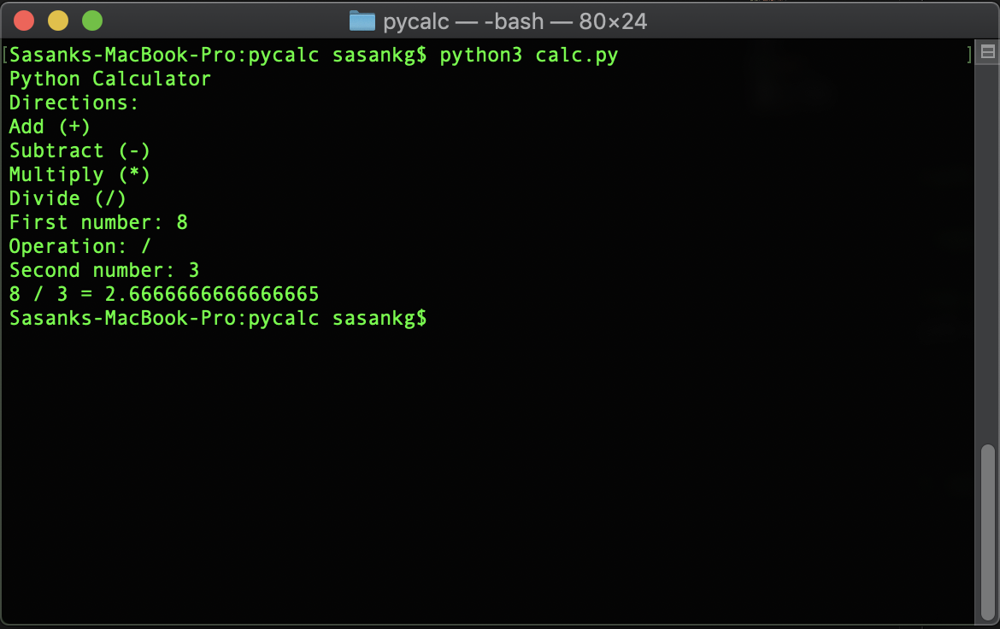

# Python Calculator

## A simple single operation calculator run on the command line

    

Another simple excercise I worked on to get my feet wet with python

### Software

- **Python3** was used to make the calculator

### Author
- **Sasank Ganapathiraju**